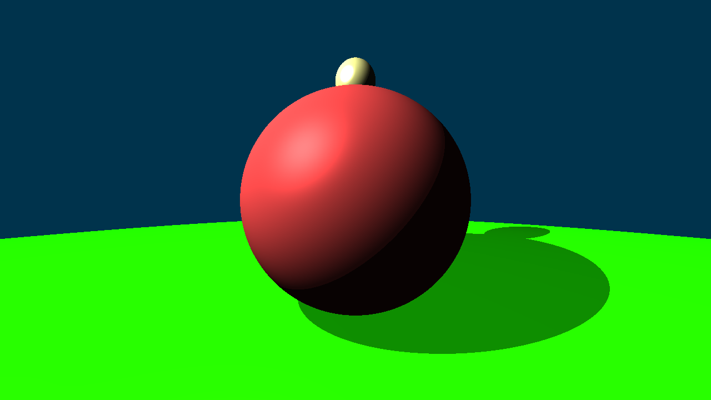
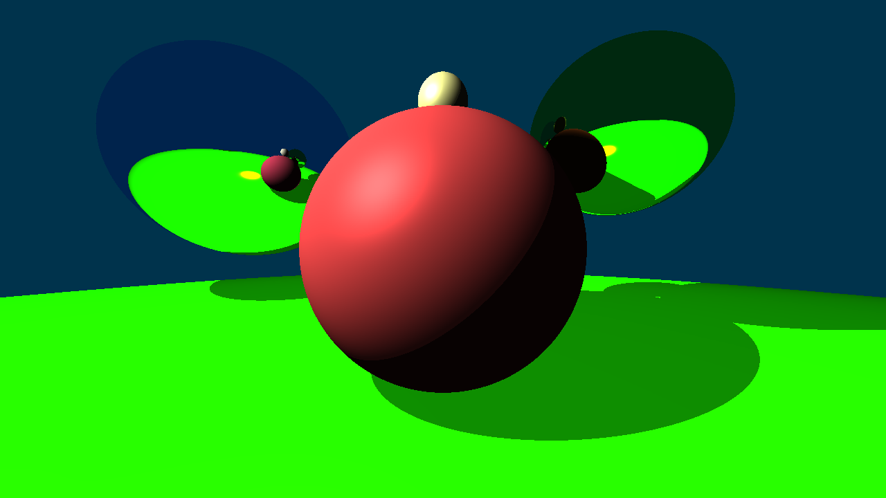
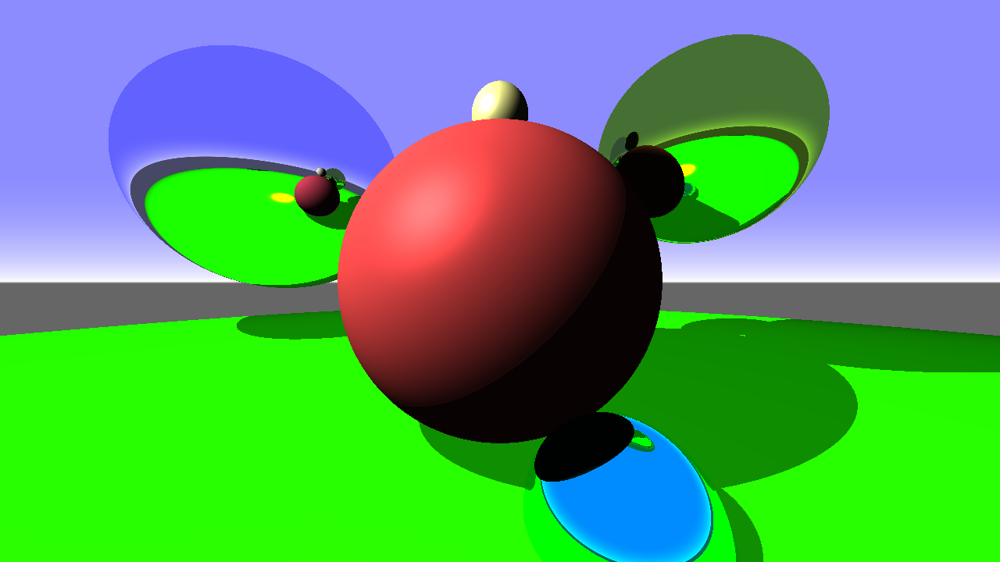

# cpu-raytracer
cpu-raytracer is a basic C++ ray tracer on the CPU, made with no libraries (except stb_image_write).

## results




## how to build
First, you must have:
- C++
- CMake and Conan

Then run:
```
.\build.bat
```
in the terminal/console.
